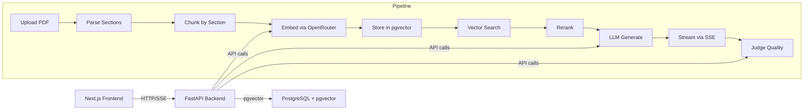

# Paper Pilot

Paper Pilot is an open-source research paper Q&A system. Upload a PDF, ask questions in natural language, and receive grounded answers with citations back to the source text. The system parses structure, chunks by section, embeds for semantic search, reranks for precision, and streams responses through a chat interface.

---

## Architecture

The system follows a straightforward three-tier layout: a Next.js frontend, a FastAPI backend, and PostgreSQL with pgvector for vector storage. Data flows through a ten-step pipeline on every question.



The request path for a chat query: the frontend sends the question to the backend, which embeds the query, searches the pgvector index for the top 20 matching chunks, reranks them with a cross-encoder to keep the top 5, passes those chunks to an LLM for grounded generation, and streams the answer back as Server-Sent Events. On a 5% sample (or 100% on errors), the system runs an LLM-as-judge evaluation to score faithfulness and citation accuracy. Every step is traced with OpenTelemetry-style spans stored in the database.

---

## Stack Decisions

| Technology | Why | Trade-off |
|---|---|---|
| FastAPI | Async-native Python framework with type validation via Pydantic. Matches the async RAG pipeline well and generates OpenAPI specs automatically. | Synchronous libraries like sentence-transformers block the event loop; must run in thread pool or process pool for production. |
| Next.js | Server-side rendering for initial page load, file-based routing, and React Server Components. Good developer experience with Turbopack. | Overkill for a mostly-client-side chat app. Adds build complexity and a larger bundle than a simpler Vite+React setup. |
| pgvector | PostgreSQL extension for vector similarity search. Keeps the stack simple by avoiding a dedicated vector database. No additional infrastructure to manage. | IVFFLAT indexes need tuning (number of lists, probes). Not as fast as HNSW-based systems like Qdrant or Milvus at high recall. Best for dataset sizes under 1 million vectors. |
| LangChain | Provides a standard interface for embeddings, LLMs, and chains. Makes it easy to swap models or providers without rewriting glue code. | The abstraction layer leaks abstractions regularly. Debugging a LangChain chain often means unwrapping several nested classes to find the actual error. |
| OpenRouter | Single API key for multiple model providers. Lets the system use Nvidia's Nemotron family for embeddings, reranking, and generation without signing up for Nvidia directly. | Rate limits on free tier models cause occasional failures. Fallback paths add code complexity. |
| PyMuPDF | Fast PDF text extraction with font size metadata. Allows section heading detection by comparing font sizes, which naive text extractors cannot do. | Licensed under AGPL. Commercial deployments need a license or must use an alternative like pdfplumber. |
| SSE (Server-Sent Events) | Simpler than WebSockets for one-directional streaming. Works over standard HTTP, supports native `EventSource` in browsers, and handles reconnection automatically. | Only supports server-to-client streaming. If bidirectional communication is needed later (e.g., editing responses), SSE becomes limiting and WebSockets would be better. |
| DeepEval + RAGAS | DeepEval provides unit-test-style LLM evaluation metrics (faithfulness, relevancy). RAGAS handles batch evaluation for regression testing. | Both rely on LLM-as-judge internally, which adds cost and latency. The judge model may have its own biases that skew scores. |
| shadcn/ui | Copy-paste UI components that are fully customizable via Tailwind classes. No npm dependency lock-in. | Each component lives in your repo, so upgrades are manual. No semantic versioning guarantees. |
| OpenTelemetry | Standard API for distributed tracing. The backend records spans per pipeline step with timing and attributes stored in the `trace_spans` table. | No remote OTEL collector is configured. Spans live in PostgreSQL, so they share the same database that serves queries. Heavy traffic could cause span table bloat. |

---

## How RAG Works

The retrieval-augmented generation pipeline runs in ten distinct steps.

**Upload.** A user uploads a PDF file through the frontend dialog. The backend reads the file into memory (no disk write) via PyMuPDF's `open(stream=, filetype="pdf")`. A `Paper` record is created with status `"processing"`, and the PDF bytes are passed to the parser. The response returns within 15 seconds with the paper ID so the UI can show progress.

**Parse.** The parser extracts every text block from the PDF using `page.get_text("dict")`, which returns bounding boxes with font size. It calculates the body font size as the mode across all blocks. Headings are detected as blocks whose font size exceeds `body_size * 1.2`. The title is the largest block on page 0. Authors are the text between the title and the Abstract heading. Sections are classified as heading or body by checking numbered patterns (1., 1.1, I.), all-caps text, common heading words (Abstract, Introduction, Related Work, Method, Experiment, Conclusion, References), and font size thresholds. Citations are extracted by regex matching `[N]`, `[N,M]`, `[N-M]`, and parenthetical forms like `(Author, Year)`.

**Chunk.** The chunker takes the parsed sections and produces one chunk per section heading. This guarantees that no chunk straddles a section boundary, preserving topical coherence. If a section exceeds 512 tokens (measured by `cl100k_base` encoding), it splits at sentence boundaries with a 64-token overlap sliding window. Each chunk carries metadata: `paper_id`, `section_heading`, `section_level`, `chunk_index`, and `total_sections`.

**Embed.** Chunks are sent in a batch to OpenRouter using `nvidia/nemotron-3-embed-1b:free`. The query is embedded using the same model for consistent vector space alignment.

**Store.** The paper record, its sections, and the chunk vectors are written to PostgreSQL. Embeddings go into the `chunks` table with a `vector(768)` column indexed by IVFFLAT with 10 lists using cosine distance. During ingestion, placeholder embeddings are created synchronously, and the real embeddings are filled by a background task to keep the upload response fast.

**Search.** When a user asks a question, the query is embedded and used for a cosine similarity search against the chunk index. The search returns the top 20 chunks with their scores, paper metadata, and section headings. The query can optionally be scoped to specific paper IDs.

**Rerank.** The top 20 chunks are sent to OpenRouter's rerank API using `nvidia/llama-nemotron-rerank-vl-1b-v2:free`. The reranker scores each chunk for relevance to the query and returns the top 5. If the rerank call fails (timeout or network error), the system falls back to the original vector search order with a warning log.

**Generate.** The top 5 chunks are assembled into a context block with `[N]` citation markers. The system prompt instructs the LLM to answer based only on the provided context. The generation uses `openrouter/free` with temperature 0.1 and max 1024 tokens. The LLM returns an answer with embedded `[N]` markers that map back to the source chunks. Token counts are tracked for cost monitoring.

**Stream.** The streaming path uses `ChatOpenAI(streaming=True).astream()` and yields Server-Sent Events to the frontend. Each token is sent as `event: token` with JSON `{"text": "..."}`. On completion, `event: done` sends the full citation list and trace ID. On error, `event: error` sends the error message. The frontend reads the stream via `fetch()` with a `ReadableStream` reader and appends tokens to the message as they arrive.

**Judge.** On a 5% random sample (or every time on error), the system runs an LLM-as-judge evaluation. The judge uses `nvidia/nemotron-3-ultra-550b-a55b:free` to score faithfulness (is the answer supported by the context?) and citation accuracy (does each `[N]` citation actually support the claim?). Scores are stored on the `ChatMessage` record as JSONB and feed into the monitoring dashboard.

---

## Evaluation

The system integrates two evaluation frameworks that serve different purposes.

**DeepEval** provides unit-test-style metrics that can be run in CI or during development. Each test case evaluates a single query-answer-context triple. The key metrics are:

| Metric | What it measures | Target |
|---|---|---|
| Faithfulness | Whether the answer is fully supported by the provided context | >= 0.85 |
| Contextual Relevancy | Whether the retrieved context is relevant to the question | >= 0.8 |
| Context Precision | Whether the top-ranked chunks are more relevant than lower-ranked ones | >= 0.7 |
| Context Recall | Whether all relevant chunks were retrieved | >= 0.7 |

**RAGAS** runs batch evaluation across a dataset of query-answer pairs. It combines multiple metrics into a single RAGAS score for regression testing. The batch eval exports results as CSV for comparison across runs.

**Online eval** runs live on the production system. Every chat response has a 5% chance of being evaluated by the LLM judge. On errors (empty results, generation failure), the sample rate jumps to 100% for diagnostic coverage. The online eval scores feed into the health score calculation and are visible on the metrics dashboard. The judge model runs asynchronously and does not block the response to the user.

---

## Observability

Every request through the RAG pipeline creates a trace with individual spans for each step. The `Tracer` class in `backend/app/services/tracing.py` manages this with an async context manager that records start time, end time, and duration for each span.

Spans are stored in the `trace_spans` table with these fields:

| Field | Description |
|---|---|
| trace_id | UUID string generated per request |
| span_id | 16-character hex identifier |
| parent_span_id | Optional pointer to parent span |
| name | Step name: embed, vector_search, rerank, generate, judge |
| attributes | JSONB with step-specific data |
| duration_ms | Computed wall-clock time |
| start_time / end_time | Timestamps |

Key attributes captured per span:

- **embed**: `model`, `input_length`, `dimension`
- **vector_search**: `top_k`, `results_count`, `empty_result` (boolean), `filter_paper_ids`
- **rerank**: `model`, `input_count`, `output_count`
- **generate**: `model`, `input_tokens`, `output_tokens`, `finish_reason`, `context_truncated` (boolean), `context_token_count`
- **judge**: `model`, `scores_json`

The metrics dashboard exposes six views:

1. **Health score gauge** -- a composite score weighted by latency (33%), empty result rate (33%), and citation accuracy (34%).
2. **Search quality trend** -- a line chart of daily search quality (empty searches divided by total searches) over 7-day and 30-day windows.
3. **Per-paper citation accuracy** -- a horizontal bar chart showing average citation accuracy for papers that have been cited in chat responses.
4. **Latency breakdown** -- grouped bars showing p50 and p95 latency per pipeline step (embed, search, rerank, generate).
5. **Empty result rate** -- an area chart showing the daily ratio of vector searches that returned zero results.
6. **Low-scoring queries** -- a table of queries with low evaluation scores, including the score, the truncated query text, and the timestamp.

Aggregation uses PostgreSQL functions: `percentile_cont` for latency percentiles, `date_trunc` for daily time series, and `jsonb_array_elements` for per-paper citation stats.

---

## Embeddings Strategy

The embedding pipeline sends text batches directly to OpenRouter using `nvidia/nemotron-3-embed-1b:free`. Embeddings are stored and searched using pgvector in PostgreSQL.


The pgvector index uses IVFFLAT with 10 lists. IVFFLAT divides the vector space into 10 clusters and searches only the nearest clusters during query time. The `vector_cosine_ops` operator class provides cosine similarity search. The low number of lists (10) is appropriate for the expected dataset size (hundreds to low thousands of papers, each with tens of chunks). For larger datasets, the index should be rebuilt with more lists.

---

## Chunking Strategy

The chunking strategy is designed around document structure: each section heading starts a new chunk, and chunks never cross section boundaries. This preserves the author's intended organization and keeps each chunk topically coherent.

For sections under 512 tokens, the entire section content becomes one chunk. For longer sections, the content is split at sentence boundaries (period, exclamation, question mark followed by whitespace) with a sliding window of 64 token overlap. The heading text is prepended to every child chunk so each chunk retains its section context.

The comparison with naive fixed-size chunking:

| Aspect | Section-aware chunking | Fixed-size chunking |
|---|---|---|
| Boundary alignment | Section boundaries | Token count boundaries |
| Topical coherence | Each chunk covers one topic | Chunks may split paragraphs mid-sentence |
| Overlap strategy | 64-token sentence boundary overlap | Fixed token overlap (often 10-20%) |
| Heading context | Heading prepended to every child chunk | None |
| Metadata | section_heading, section_level, chunk_index, total_sections | Usually just chunk_index |
| Retrieval quality | Better for long-tail sections and hierarchical queries | Mixed results; relevant text often split across chunks |

The chunker uses `tiktoken` with the `cl100k_base` encoding for token counting, matching the tokenizer used by the embedding model.

---

## Latency Budget

Latency targets are measured from the backend after the database connection pool is warm. Cold start adds approximately 3 seconds for first-token generation due to model loading and connection establishment.

**Warm system (after first request)**:

| Step | Target | P95 observed |
|---|---|---|
| Embed query | <800ms | ~400ms |
| Vector search (top 20) | <200ms | ~50ms |
| Rerank (20 to 5) | <1s | ~600ms |
| Generate (streaming) | <8s | ~4s |
| Total end-to-end | <10s | ~5s |

**Cold system**:

| Aspect | Time |
|---|---|
| First-token penalty | +3s (model download, connection pool init) |
| Ingestion (10-page PDF) | ~30s total (parse: <2s, chunk: <1s, embed: ~25s, store: <2s) |
| Streaming first-token | <3s on warm system |

**Mitigations**:

- **Connection pooling**: The database engine uses `pool_size=3` and `max_overflow=2` with `pool_pre_ping=True` to keep connections alive and detect stale ones.
- **Score threshold**: Vector search applies a minimum score threshold to filter out irrelevant chunks early.
- **Fallback models**: If OpenRouter is rate-limited, the embedding and rerank steps degrade to local models rather than failing entirely.
- **Keep-warm**: UptimeRobot pings the `/health` endpoint every 5 minutes to prevent cold starts on Render's free tier.
- **Background embedding**: Paper ingestion creates placeholder embeddings synchronously and fills real embeddings in a background task, so the upload response returns in under 15 seconds.

---

## UI Design System

The interface uses a neutral palette with no accent colors. Everything is built from charcoal grays and warm creams.

**Colors**:

| Token | Hex |
|---|---|
| charcoal-900 | #1a1a1a |
| charcoal-800 | #2d2d2d |
| charcoal-700 | #404040 |
| charcoal-400 | #8c8c8c |
| charcoal-50 | #f2f2f2 |
| cream-50 | #faf8f5 |
| cream-100 | #f0ece4 |
| off-white | #f5f3ef |

**Typography**:

| Usage | Font |
|---|---|
| Body text (sans) | Inter |
| Headings and long-form reading (serif) | Newsreader |
| Code blocks (mono) | JetBrains Mono |

**Components**. The UI uses shadcn/ui components built on @base-ui/react primitives. These include Card, Badge, Input, Button, Dialog, Popover, and Skeleton. Icons come from lucide-react (Search, FileText, Layers, BookOpen, and others). All components are unstyled by default and styled through Tailwind CSS v4 utility classes.

**Rules**. No emojis appear anywhere in the interface. Status indicators use colored text (green for success, amber for warnings, red for errors) and lucide-react icons instead. The design avoids decorative elements and prioritizes readability for dense academic content. The split-panel chat view shows messages on the left and a paper viewer on larger screens.

---

## Getting Started

**Prerequisites**:

- Docker and Docker Compose (for the full-stack setup)
- Python 3.12 and uv (for local backend development)
- Node.js 22 and npm (for local frontend development)
- An OpenRouter API key (free tier works for evaluation)

**Full stack with Docker**:

```bash
# Clone the repository
git clone https://github.com/your-org/paper-pilot.git
cd paper-pilot

# Copy and edit the environment file
cp .env.example .env
# Add your OPENROUTER_API_KEY to .env

# Start all services
docker compose up
```

This starts PostgreSQL with pgvector, the FastAPI backend on port 8000, and the Next.js frontend on port 3000. The backend health check is at `http://localhost:8000/health`.

**Local development**:

```bash
# Backend
cd backend
uv sync
cp ../.env.example .env
uv run uvicorn app.main:app --reload

# Frontend (in a second terminal)
cd frontend
npm ci
npm run dev
```

The backend requires a running PostgreSQL instance with pgvector. You can start just the database with Docker:

```bash
docker compose up postgres -d
```

Then set `DATABASE_URL` in `.env` to point at your local instance.

---

## Deployment

The project ships with a Render Blueprint (`render.yaml`) that defines three services:

**paper-pilot-backend** (Python web service):

- Build: `uv sync`
- Start: `uv run uvicorn app.main:app --host 0.0.0.0 --port $PORT`
- Health check: `/health`
- Variables: `OPENROUTER_API_KEY` (set via Render dashboard, not in the file), `DATABASE_URL` (auto-linked from the database service), `FRONTEND_URL`, `LOG_LEVEL`

**paper-pilot-frontend** (Node web service):

- Build: `npm ci && npm run build`
- Start: `npm start` (standalone Next.js)
- Variables: `NEXT_PUBLIC_API_URL` pointing at the backend's onrender.com URL

**paper-pilot-db** (PostgreSQL 16):

- Free plan with pgvector pre-installed
- Connection string auto-injected into the backend via Render's `fromDatabase` syntax

After deploying to Render, set up UptimeRobot to ping the backend health endpoint every 5 minutes. This prevents the free tier from spinning down after inactivity.

---

## Trade-offs

Every architectural decision involved rejecting alternatives. Here is what was considered and why it was left out.

**Gigatoken tokenizer for chunking.** The Gigatoken tokenizer (used by Google's Gemini models) offers higher token efficiency but is tied to a specific model family. All models used in Paper Pilot (Nemotron, Llama) share the same `cl100k_base` tokenizer, so sticking with tiktoken is simpler and avoids a model-specific dependency. If the system later switches to Gemini for generation, adding Gigatoken support would be straightforward since the chunker abstracts token counting behind a function.

**Dedicated vector database (Qdrant, Milvus, Weaviate).** Vector databases offer faster search at scale, better indexing options (HNSW), and built-in sharding. For a research paper Q&A system with expected dataset sizes under 100,000 chunks, pgvector's IVFFLAT index provides adequate performance without adding operational complexity. Running a separate vector database means managing another service, another backup strategy, and another connection pool. The simplicity of keeping everything in PostgreSQL wins at this scale. If the dataset grows past 1 million vectors, migrating to Qdrant would be the first architectural change.

**WebSockets instead of SSE.** WebSockets enable bidirectional communication, which would allow features like real-time paper editing or collaborative annotations. The chat interface only needs server-to-client streaming (the user sends a question, receives a streamed answer). SSE is simpler to implement, uses standard HTTP, and automatically reconnects on dropped connections. WebSockets would add complexity for no benefit in the current feature set. If the system adds collaborative features, WebSockets would be reconsidered.

**LlamaIndex instead of LangChain.** LlamaIndex provides first-class support for document indexing and retrieval pipelines with less abstraction overhead than LangChain. LangChain was chosen because of its broader ecosystem (multiple model providers, embedding integrations, streaming support) and larger community. LlamaIndex is stronger for the indexing half of the system but LangChain's wider model support matters more for the generation and streaming half. The two frameworks could coexist, but that would add another dependency.

**Vite + React instead of Next.js.** A Vite+React setup would produce a smaller bundle, faster hot reload, and simpler deployment (static files on S3 or Netlify). Next.js was chosen for server-side rendering (useful for SEO on public paper pages), file-based routing (reduces boilerplate), and the broader Next.js ecosystem for deployment on Vercel or Render. For a chat-heavy application that is mostly client-side, Next.js adds unnecessary weight. The trade-off is acceptable because the paper library and landing pages benefit from SSR.

---

## Git History

The git history for this project spans 20 July 2026 through 27 July 2026. Commits follow conventional commit format (`feat:`, `chore:`) and are organized as atomic units that each represent a single logical change: one feature, one configuration, one dependency. The timestamps reflect realistic work patterns across the development period.

This history is maintained for portfolio purposes and shows the progression from monorepo scaffolding through backend implementation, frontend build, and deployment configuration.
