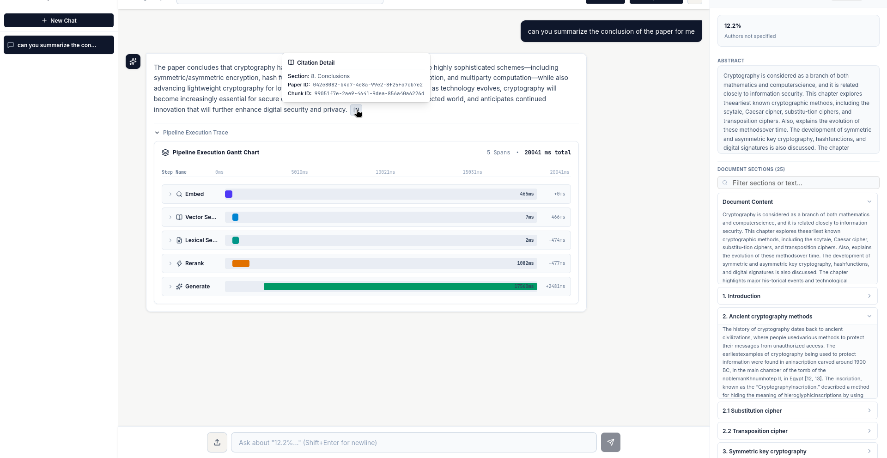
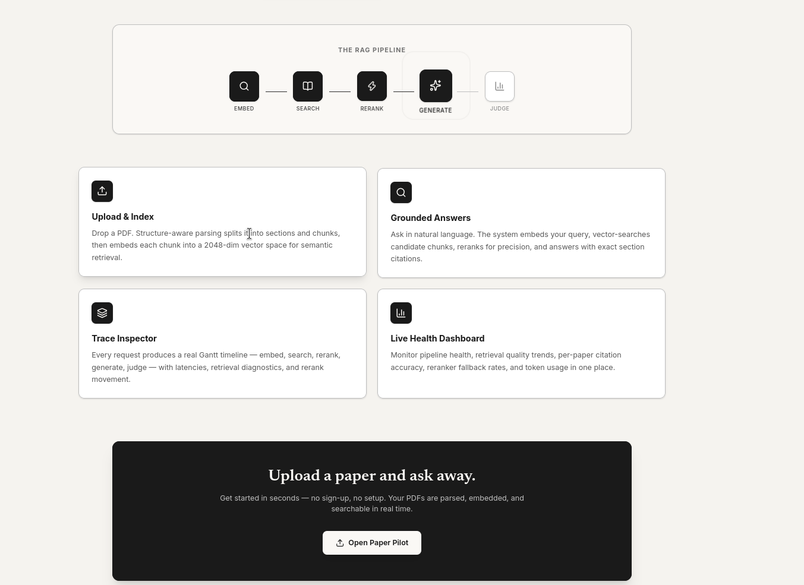
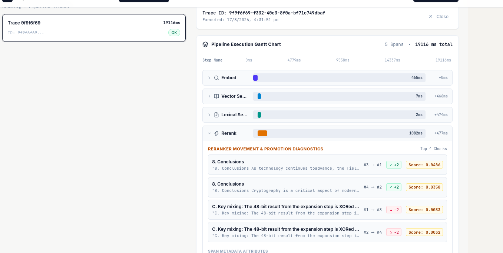
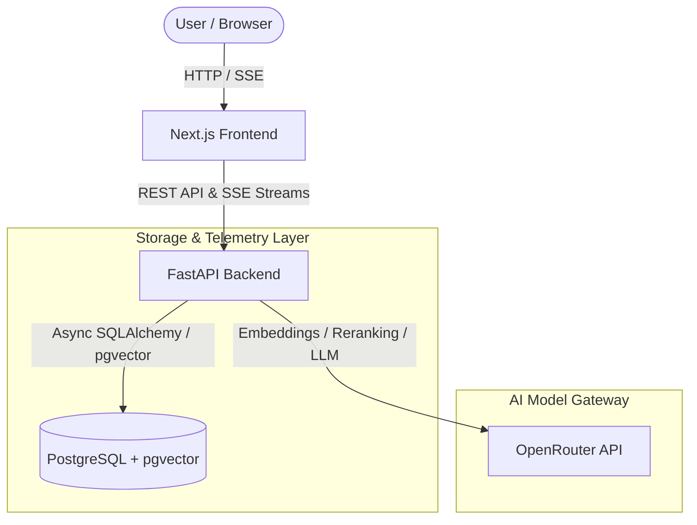
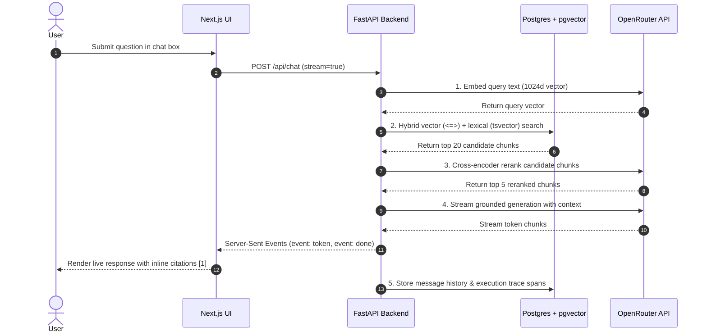

# Paper Pilot

Paper Pilot is a research paper Q&A platform built for grounded document reasoning. It parses PDFs into structural section hierarchies, runs hybrid vector + lexical search fused with cross-encoder reranking, and streams answers with interactive inline citations.

Built with operational transparency in mind, every query features **end-to-end request traceability**—recording granular execution spans across embedding, retrieval, reranking, and generation stages—paired with real-time quality metrics and waterfall trace inspection.

---

## Interface Screenshots

### Grounded Research Chat


### Metrics Dashboard


### Trace Inspector


---

## Architecture



### RAG Pipeline Flow



---

## Stack Choices & Rationale

* **FastAPI (Backend)**  
  Async-native Python framework with built-in Pydantic schema validation. Handles concurrent streaming responses and NLP pipeline tasks cleanly without blocking.

* **Next.js & TailwindCSS (Frontend)**  
  Provides fast client-side rendering, SSE stream consumption, and customizable component styling without bundle bloat.

* **PostgreSQL + `pgvector` (Database & Vector Store)**  
  Keeps relational metadata, trace logs, and vector embeddings in a single database. Avoids the operational overhead of running and syncing a separate vector DB cluster (e.g. Pinecone/Qdrant).

* **PyMuPDF (`fitz`) (PDF Parsing)**  
  Extremely fast PDF text extraction that preserves font sizes and layout metadata. Enables accurate section heading identification based on font weight and size hierarchy.

* **Hybrid Search + Reciprocal Rank Fusion (RRF) + Reranking**  
  Combines dense vector similarity search with Postgres full-text lexical search (`to_tsvector`), merges ranks using RRF, and filters results through a cross-encoder reranker before feeding context to the LLM. This prevents missing keyword hits and reduces hallucination.

* **Server-Sent Events (SSE)**  
  Used for streaming tokens from LLM to frontend over standard HTTP. Simpler and lighter than WebSockets for single-directional response generation.

---

## Advanced RAG Engineering & Evaluation Strategy

Paper Pilot incorporates industry-standard production RAG patterns designed to eliminate common failure modes (such as retrieval vocabulary gaps, hallucinated citations, and context dilution).

### 1. Multi-Stage Retrieval Architecture
* **Structure-Aware Section Chunking**: PDF layout font metadata is extracted via PyMuPDF to construct section hierarchies. Content is chunked along section boundaries with parent-child metadata rather than naive token splitting.
* **Hybrid Search + Reciprocal Rank Fusion (RRF)**: Executes dense vector similarity search (`pgvector` cosine ops) alongside sparse lexical full-text search (`to_tsvector`), fusing ranks via RRF ($k=60$) to capture both semantic meaning and specific keyword terms.
* **Cross-Encoder Reranking**: Re-scores top 20 candidate chunks down to top 5 using a cross-encoder model before context construction, significantly boosting context precision.
* **Multi-Turn Query Rewriting**: Evaluates user conversation history to rewrite ambiguous follow-up questions before executing retrieval.

### 2. Evaluation System (Online & Batch)
The platform includes dual evaluation pipelines to track grounding and retrieval performance:

* **Online LLM-as-a-Judge (`online_eval.py`)**: Evaluates responses live in production asynchronously (5% background sampling, 100% coverage on errors):
  * **Faithfulness**: Measures if generated claims are 100% supported by the retrieved context.
  * **Citation Accuracy**: Verifies that each inline citation badge `[N]` points to a chunk containing the true factual evidence.
* **Batch RAGAS Evaluation (`scripts/ragas_eval.py`)**: Automated test suite measuring standard RAG metrics:
  * **Faithfulness**: Claim verification ratio against retrieved context.
  * **Answer Relevancy**: Direct semantic alignment between query intent and response.
  * **Context Precision**: Signal-to-noise ratio in top-ranked chunks.
  * **Context Recall**: Ground-truth coverage across retrieved chunks.

### 3. Telemetry & Execution Tracing
Every request records OpenTelemetry-style execution spans (`embed`, `query_rewrite`, `vector_search`, `lexical_search`, `rerank`, `generate`, `judge`). Spans capture timing, token counts, and retrieval scores, feeding directly into the **Trace Inspector** waterfall view and operational **Dashboard KPIs**.

---

## Key Features

* **Structure-Aware Chunking**: Chunks papers by section headings rather than arbitrary token boundaries, preserving topical context.
* **Interactive Citations**: Answers include clickable `[1]`, `[2]` citation badges mapping directly to section headers and chunk IDs.
* **Paper Inspector**: Collapsible side drawer to review abstract, metadata, and full document section breakdown while chatting.
* **Operational Telemetry & Traces**: Built-in trace waterfall viewer to inspect latency, embedding dimensions, and search scores for every query.
* **Chat Session Management**: History drawer with session persistence and idempotent session deletion.

---

## Quick Start

### Prerequisites
* Docker & Docker Compose
* OpenRouter API Key

### 1. Configure Environment Variables
Copy `.env.example` to `.env`:
```bash
cp .env.example .env
```
Fill in your `OPENROUTER_API_KEY` in `.env`.

### 2. Launch with Docker Compose
```bash
docker compose up --build
```

### 3. Open Application
Navigate to [http://localhost:3000](http://localhost:3000) in your browser.

---

## Core API Endpoints

| Method | Endpoint | Description |
|---|---|---|
| `POST` | `/api/papers/upload` | Upload and index a PDF paper |
| `GET` | `/api/papers` | List indexed papers with metadata |
| `POST` | `/api/chat` | Query RAG pipeline (supports `stream=true`) |
| `GET` | `/api/chat/sessions` | List active chat history sessions |
| `DELETE` | `/api/chat/sessions/{id}` | Delete a chat session |
| `GET` | `/api/metrics/summary` | Fetch operational health & latency telemetry |
